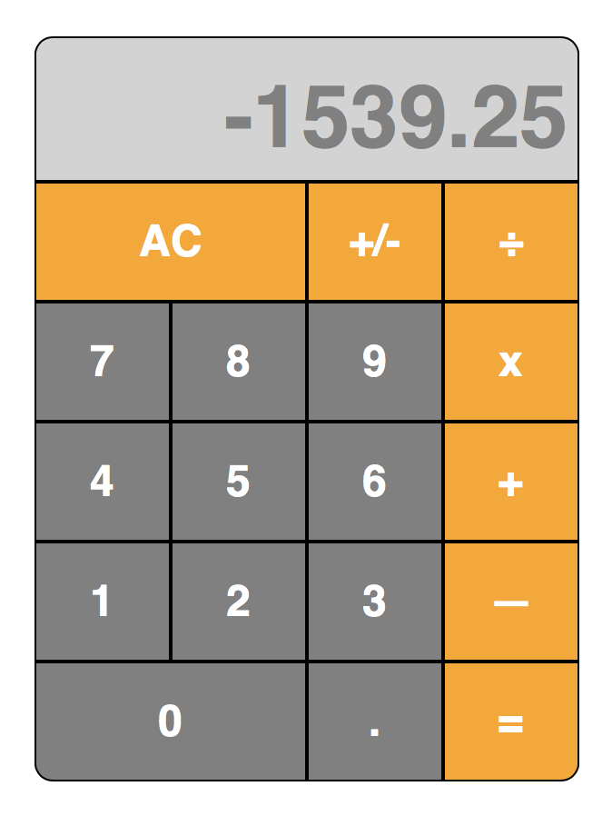

#JS-Calc

This is a basic calculator I created in response to [this assignment](http://www.theodinproject.com/javascript-and-jquery/on-screen-calculator) for the Odin Project's JS course.

I've placed a screenshot below, and you can try it out yourself [here](https://htmlpreview.github.io/?https://github.com/ubershibs/odin-js-course/blob/master/js-calc/index.html).

