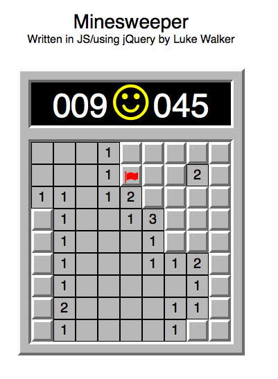

#Minesweeper

Completed for the Odin Project's course on Javascript and jQuery. The assignment can be found [on their site](http://www.theodinproject.com/javascript-and-jquery/minesweeper).

You can play the game [here](http://htmlpreview.github.io/?https://github.com/ubershibs/odin-js-course/blob/master/minesweeper/index.html).

